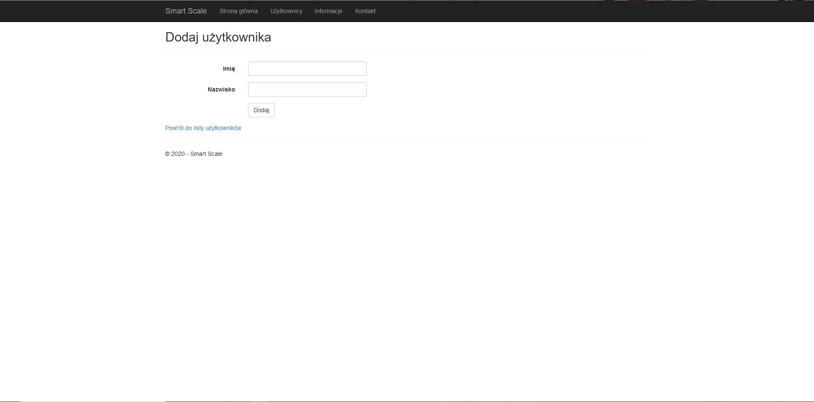
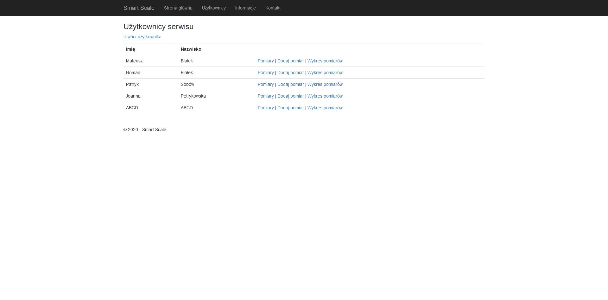
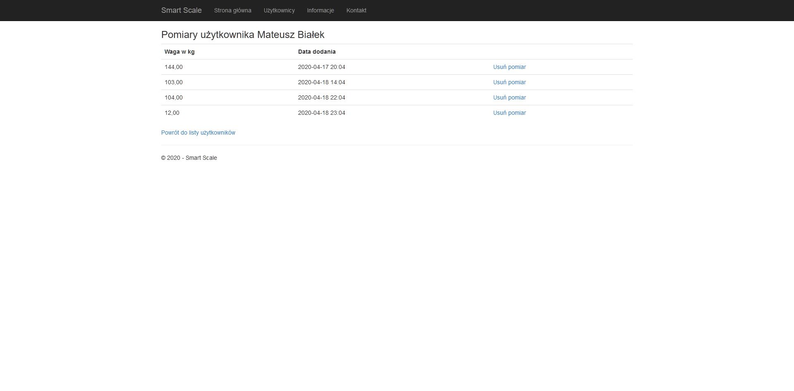
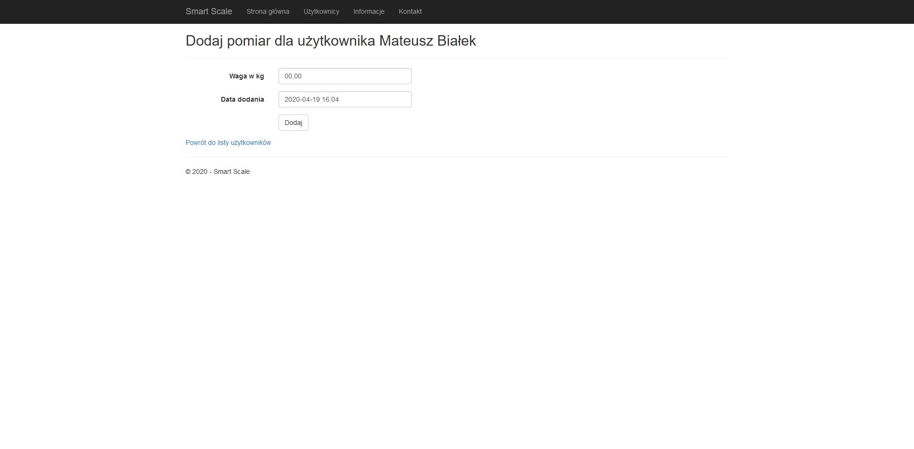
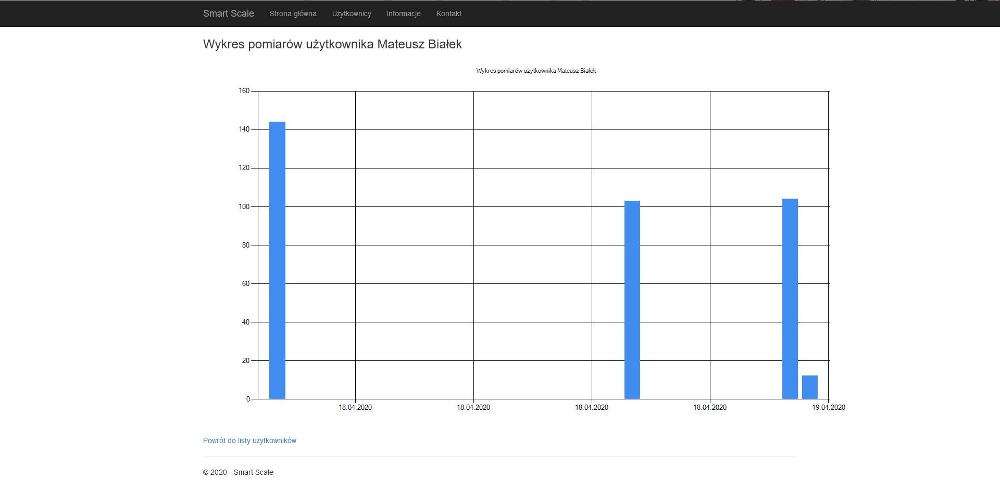

# Smart Scale
Repozytorium zawier projekt tworzony w ramach zajęć .Net-Java Platformy programistyczne.
Projekt tworzony jest w języku C# na platformę ASP.Net Core z użyciem technologi MVC.
Projekt wykorzystuje zewnetrzne zależności Entity Framework do komunikacji z lokalną bazą danych.
Dodatkowo został utworzony projekt z testami jednostkowymi, sprawdzającymi obsługę lokalnej bazy danych.

# Dotychczas dodane funkcjonalności 
- Dodawanie użytkowników

- Wyświetlanie listy użytkowników z opcjami dla każdego z nich

- Wyświetlanie listy pomiarów dla danego użytkownika z opcją usunięcia danego pomiaru

- Dodawanie pomiaru do danego użytkownika

- Wyświetlanie wykresu z pomiarami uzytkownika


# Dodawanie użytkownika i pomiaru
Przy dodawaniu użytkownika pola Imię oraz Nazwisko nie mogą być puste oraz mają być w nich tylko litery.
W przypadku złego wprowadzenia danych do tych pól pod polami pojawią się czerwone komunikaty informujące o danym wymogu.

Przy dodawaniu pomiaru dla użytkownika pole Data dodania jest wypełniane automatycznie przykładową datą w celu pokazania odpowiedniego formaty wprowadzenia daty.W przypadku złego formatu pod polem pojawi się komunikat o błędnym formacie.

# Testy jednostkowe
- Sprawdzające poprawność wyświetlania widoków strony głównej, kontaktu, informacji. 
- Sprawdzajcy czy widok "pomiary" pobiera wartości z bazy danych 
- Sprawdzający tworzenie nowego użytkownika w bazie danych
- Sprawdzający usuwanie pomiaru użytkownika z bazy danych

#### Kod testu jednostkowego sprawdzającego usuwanie pomiaru użytkownika z bazy danych :

```
      [TestMethod]
        public void Delete()
        {
            HomeController controller = new HomeController();
            // Arrange
            string Imie = "ABCD"; //Add user
            string Nazwisko = "ABCD";
            User user = new User() { Imie = Imie, Nazwisko = Nazwisko };
            db.users.Add(user);
            db.SaveChanges();
            var users = from m in db.users
                        select m;
            User userfromdb = users.First(s => s.Imie == Imie && s.Nazwisko == Nazwisko);
            int IDużytkownika = userfromdb.Id;


            decimal Waga = 10200; //Add pomiar
            DateTime Datadodania = new DateTime(2008, 5, 1, 8, 30, 52);
            Pomiar pomiar = new Pomiar() { Waga = Waga, Datadodania = Datadodania, UserId = IDużytkownika };
            db.pomiars.Add(pomiar);
            db.SaveChanges();
            var pomiars = from m in db.pomiars
                          select m;
            Pomiar pomiarfromdb = pomiars.First(s => s.Waga == Waga && s.Datadodania == Datadodania);
            int Iloscprzed = db.pomiars.Count();

            // Act
            db.pomiars.Remove(pomiarfromdb);
            db.users.Remove(userfromdb);//cleaning from db
            db.SaveChanges();
            int Iloscpo = db.pomiars.Count();

            // Assert
            Assert.AreEqual(Iloscpo+1, Iloscprzed);
        }
```

